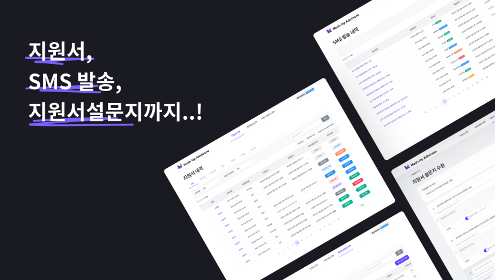
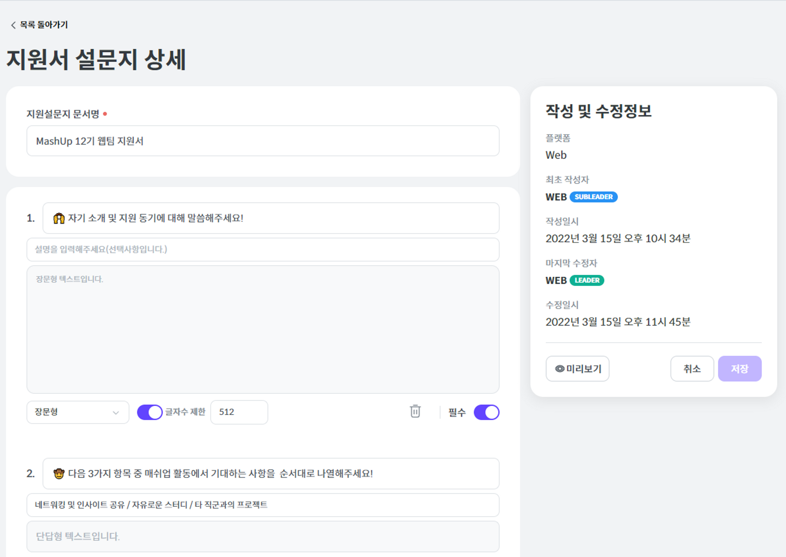
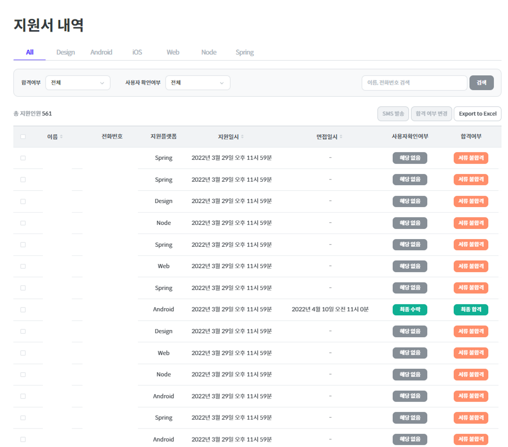
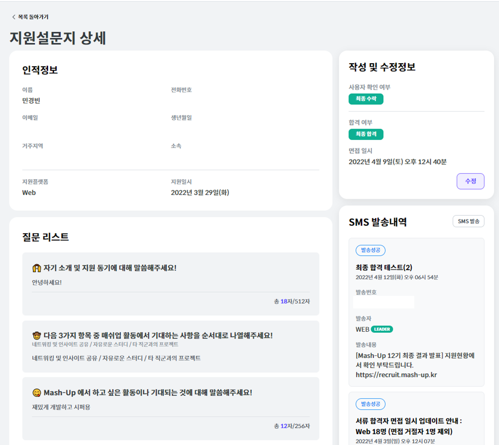
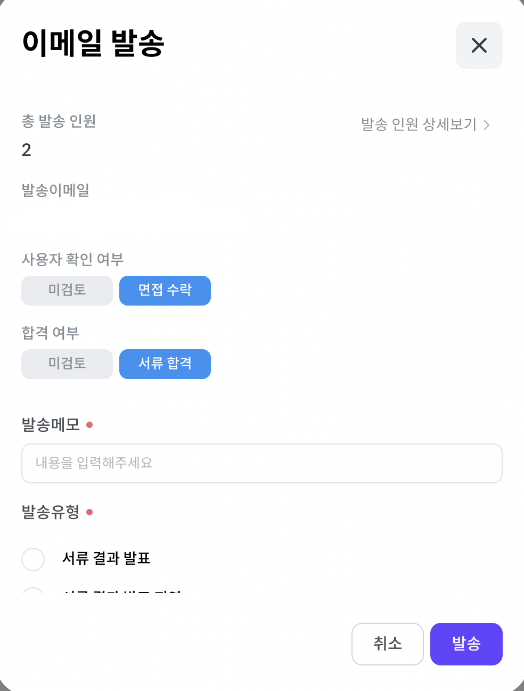
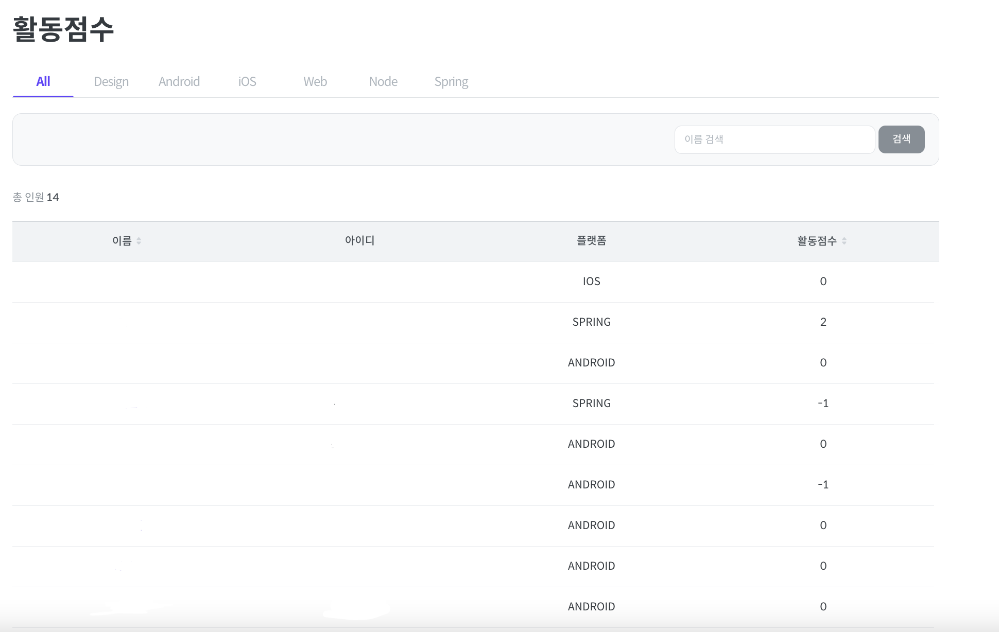
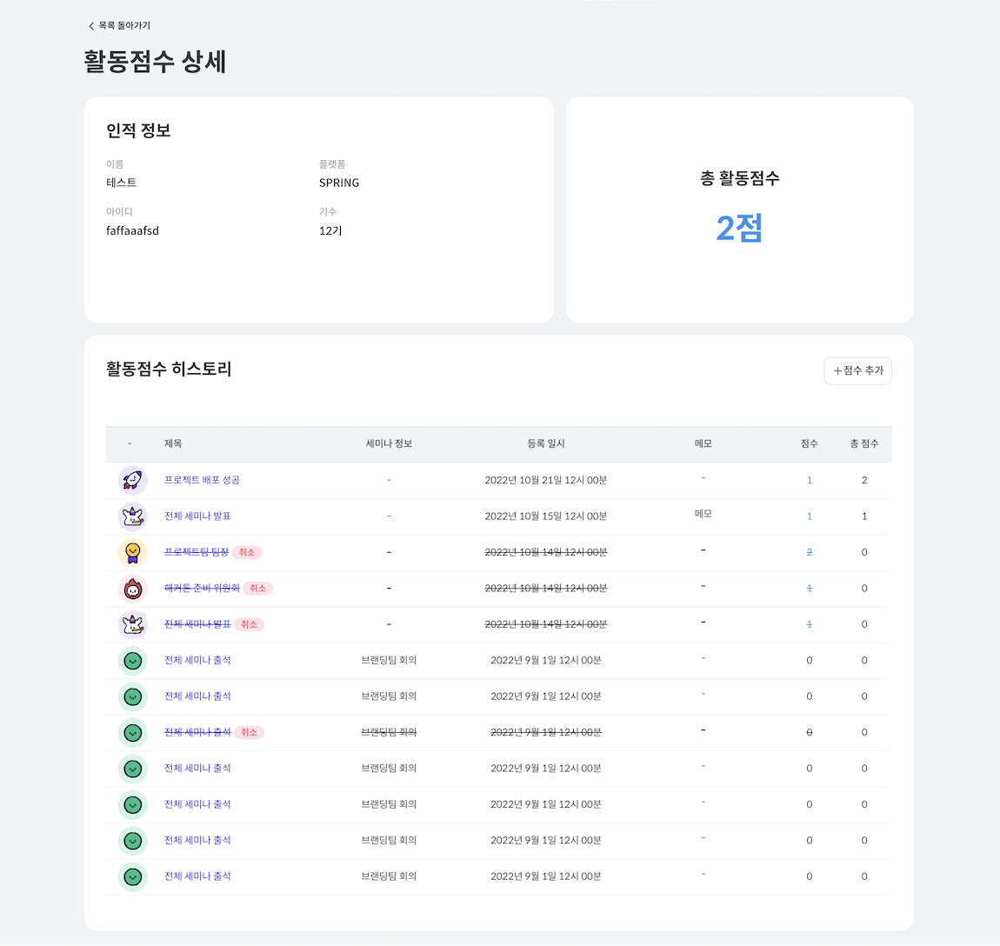
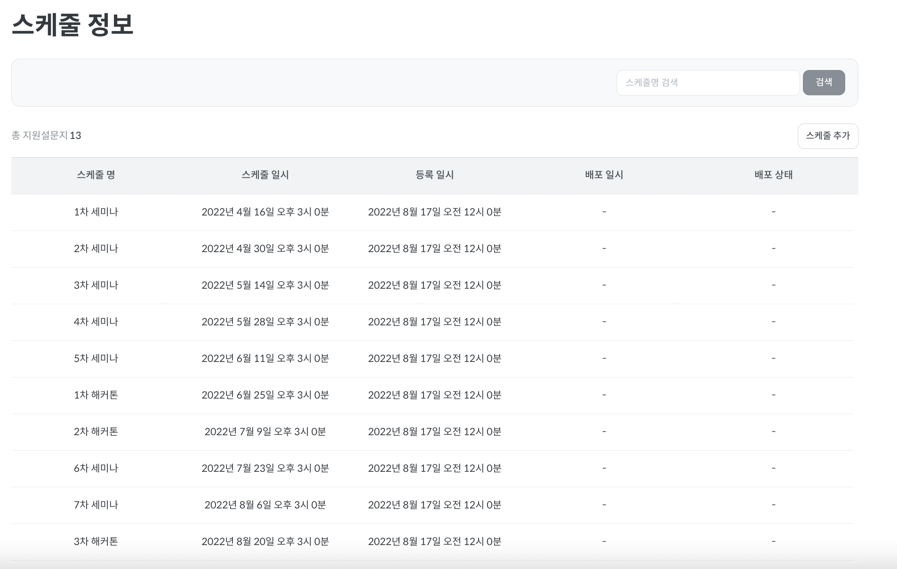
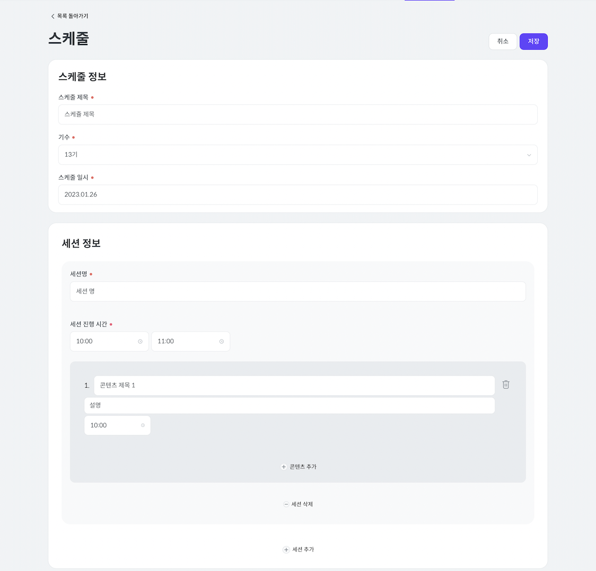

# Mash Up Admin

Mash Up Admin 서비스는 동아리를 조금 더 효율적으로 운영하기 위해 개발한 내부 플랫폼 서비스입니다.

Mash Up Admin 서비스는 아래와 같은 업무를 효율적으로 처리할 수 있게 합니다.

- 지원 프로세스
- 출결 관리

## 지원 프로세스 플랫폼화

새로운 기수를 시작할 때 새로운 부원을 모집할 때 모집과정을 효율적으로 하기 위한 기능들 입니다.

지원 프로세스 플랫폼은 다음과 같은 기능을 제공합니다.

1\. 각 팀별 지원서에 들어갈 지원서를 만들 수 있습니다.

지원서에는 문서명, 질문 항목이 포함되며 질문을 만들 때 다음과 같은 옵션을 설정할 수 있습니다.

- 단답형, 장문형 선택
- 글자수 제한 설정
- 필수값 여부 설정

2\. 지원자들이 제출한 지원서를 확인할 수 있습니다.

3\. 지원설문지 상세를 통해 지원자에 대한 정보와 지원서를 확인할 수 있습니다.

4\. 지원서를 선택해 원하는 유형의 이메일을 일괄적으로 보낼 수 있습니다.

## 출결 관리 플랫폼화

동아리 활동 중 부원들의 출석 여부 관리 및 일정에 대해 관리할 수 있는 기능들 입니다.

1\. 현재 기수의 동아리 구성원들의 활동 점수를 확인할 수 있습니다.

2\. 동아리 구성원의 활동 점수 내역을 확인할 수 있습니다.

- 필요한 경우 활동 점수를 조정할 수도 있습니다.

3\. 동아리에 예정 / 진행된 일정들을 확인할 수 있습니다.

4\. 동아리의 일정을 세부적으로 조정할 수 있습니다.

## 사용한 기술

- React
- Typescript
- Emotion
- Webpack
- recoil
- Yarn berry

## 연관 레포지토리

- [Mash Up 백엔드](https://github.com/mash-up-kr/mashup-server)
- [Mash Up 지원 서비스](https://github.com/mash-up-kr/mash-up-recruit-fe)
- [Mash Up 출척체크 앱 안드로이드](https://github.com/mash-up-kr/mashup_Android)
- [Mash Up 출척체크 앱 iOS](https://github.com/mash-up-kr/mashup-ios)
